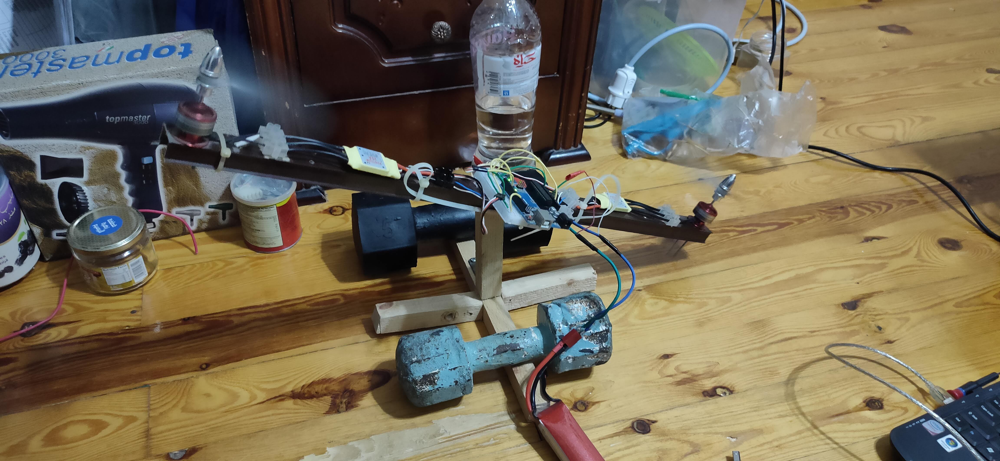

# Quadcopter-Prototype
This project is a ground-up quadcopter prototype focused on building and validating the core control stack needed for stable flight from scratch using a standard **Arduino** and the required modules (transmitter/receiver, gyro, etc.). The goal was to connect motor outputs to sensor feedback and test a closed-loop stabilization approach before moving to full-frame integration.

## Tech Stack
- **Language:** C++
- **Microcontroller:** Arduino UNO
- **Wireless (RC link):** NRF24 2.4GHz transceiver (TX/RX)
- **Sensors:** MPU-6050 Six-Axis (Gyro + Accelerometer)
- **Motor Control:** Commertial and recycled brushless motor/propeller control interface (ESC)
- **Hardware:** Prototype circuit boards (custom PCB / breadboard)/Aluminum and wooden rods
- **Input Devices:** Joysticks (Arduino built RC remote)
- **Tools:** Arduino IDE, basic bench testing/logging through Serial Monitor

## Project Goals
- Build a ground-up quadcopter control stack on an **Arduino**, integrating available modules (gyro, transmitter/receiver, motor-control hardware).
- Implement and validate a closed-loop stabilization algorithm in **C++**, using real gyro feedback to drive motor outputs.
- Design a reliable sensor-to-actuator pipeline (gyro → control loop → motor commands) that can be tested and tuned on real hardware before full-frame integration.
- Develop a custom RC transmitter/receiver from scratch using **Arduino + NRF24** (joysticks + supporting circuitry) to support manual control as an alternative to automated flight.
- Prototype hardware interfaces for expansion, including prototype PCBs and an attempted DIY brushless ESC approach using recycled brushless DC motors from old **hard drives**.
- Establish a path to full integration: scale from single-axis bench testing to multi-axis stabilization with additional ESCs and sensors (GPS/altimeter) for future flight-ready behavior.

## What I built
- An Arduino-based control system written in **C++**, implementing a closed-loop control algorithm for stabilization.
- Prototype circuit boards to interface the Arduino with brushless motor/propeller control hardware.
- A hardware test setup tying the **gyro** sensor output to motor speed control, enabling control-loop testing with real signals (shown in the demo MP4).
- A custom RC remote + receiver built from scratch using **Arduino**, **NRF24 wireless transceiver**, joysticks, and supporting circuitry, based on this reference design with modifications and alternate components:
  https://www.youtube.com/watch?v=aztm_8qGVfc&list=PLsR1AO4QH1AwEh7BZHamzsNBO-Ud-pGBW&index=3
- Attempted to build a brushless ESC (electronic speed controller) from scratch using an Arduino and a custom PCB, following this reference design, but could not complete it due to component unavailability and limited PCB fabrication capability:
  https://youtu.be/8LXPcJD6hEA?si=JXzT3ylQ1kq5TrVN

## Demo
Check the MP4 demo file in the repo, or use this link:
https://drive.google.com/file/d/1DrKHoRXCtsPM3YHi0WtCFW_7Mb5viRnu/

## How it works
- The Arduino reads angular-rate data from the gyro sensor.
- Readings are processed to estimate motion dynamics and generate control corrections.
- The control loop updates motor commands to adjust propeller speed based on measured rotation, with the intent of damping unwanted motion and improving stability.

## Current status
Development paused at the control-loop testing stage due to the **unavailability** of parts (including 2 additional ESCs). Work at this stage focused on validating the feedback loop between gyro readings and motor response, ensuring the sensor-to-actuator pipeline was reliable and that outputs behaved as expected under different test conditions.

## Next steps
- Tune control parameters and filtering to improve stability and reduce noise sensitivity.
- Expand from single-axis testing to multi-axis stabilization with the required additional components.
- Integrate additional sensors (GPS, altimeter, etc.) and move toward full flight-ready integration via an automated flight path or transmitter **signal**.
